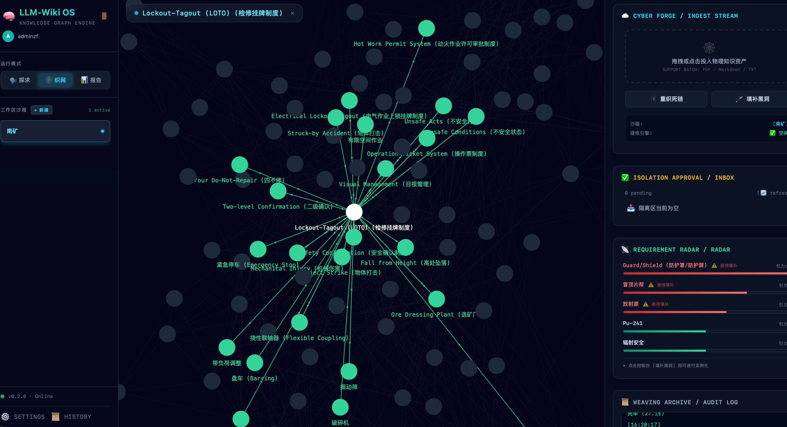
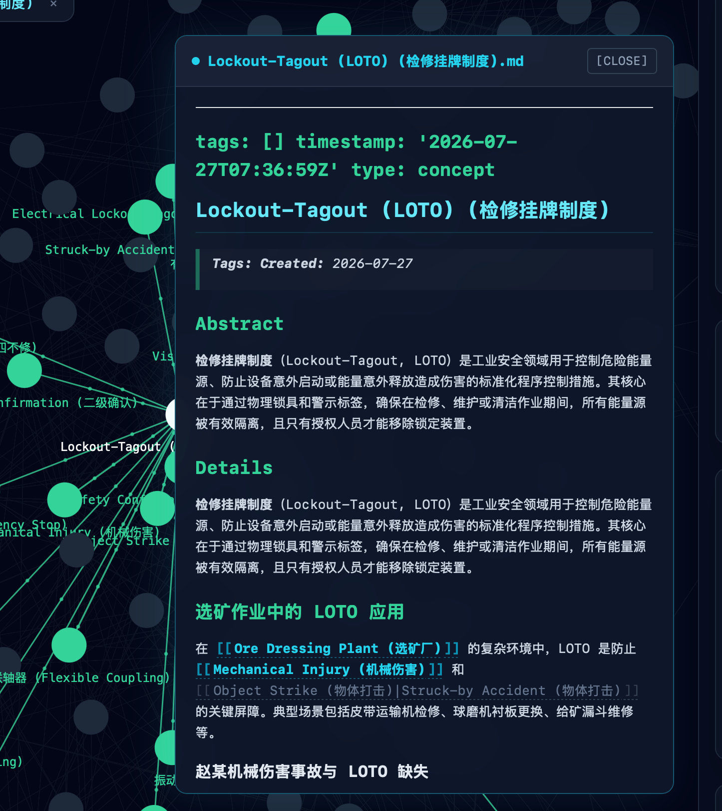
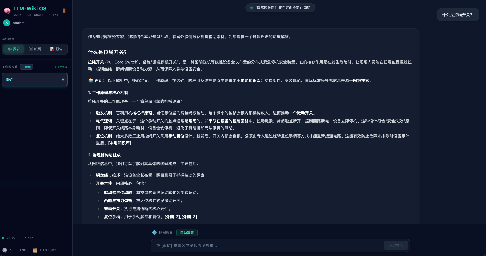

# LLM Wiki OS — 多智能体知识研究系统

> 基于 Agno 框架，让大模型像维基百科编辑团队一样持续管理你的私人知识库。

知识库不是静态文档，而是**活的系统**——自动摄入新资料、交叉验证多来源、发现概念关联、定期审查死链，7×24 运转。

---

## 界面展示

### 知识关系网络

以力导向图展示 Wiki 概念及双链关系，并提供死链检测、缺失概念填补和知识审查入口。



### Wiki 概念页

在知识网络中查看概念详情、关联页面及来源内容。

<p align="center">
  
</p>

### 多源知识问答

结合本地 Wiki 与联网检索生成带来源说明的知识回答。



---

## 已实现功能

### 🧠 知识引擎

| 功能 | 说明 |
|------|------|
| **Map-Reduce 并发摄入** | 上传 PDF/TXT/DOCX → 12 线程并发提取 → 同义词聚类 → 逐概念融合写入，兼顾效率与质量 |
| **三级流水线（CoT）** | 分析师提取概念 → 主编比对决策 → 撰稿人执行写入，中间传递 Pydantic 结构化报告 |
| **多轮智能问答** | 意图路由器自动分流（闲聊/扫描/摘要/查询），本地知识库 + 联网搜索联合检索 |
| **幽灵节点填补** | 扫描双链中的真空节点（被引用但无内容），自动合成填充 |
| **知识审查** | 死链检测 → 反向链接织网 → 孤立页面报告 |
| **批量报告生成** | 指定主题，全量检索相关概念，结构化章节合成 |
| **隔离审批区** | 新合成概念进入 Inbox，人工审批后才正式入库 |

### 👥 多用户系统

| 功能 | 说明 |
|------|------|
| **JWT 认证** | 注册白名单 + 角色管理（user/admin）+ Token 鉴权 |
| **用户物理隔离** | `data/wiki/{user_id}/{workspace}/`，每用户独立知识库空间 |
| **多沙箱管理** | 用户可创建多个知识沙箱，互不干扰 |
| **BYOK 多模型** | 用户自带 API Key，支持通义千问/DeepSeek/OpenAI 等多供应商路由 |
| **多轮会话记忆** | Agno SqliteDb 持久化，支持会话列表/历史消息/自动命名 |

### 🖥️ 前端 & 运维

| 功能 | 说明 |
|------|------|
| **SPA 前端** | React 18 + Tailwind CSS，暗色玻璃拟态风格 |
| **力导向图** | react-force-graph-2d 实时渲染知识网络拓扑 |
| **可视化进度条** | 知识提炼 4 阶段进度卡片（解析→提取→聚类→融合），SSE 实时推送 |
| **Markdown 渲染** | react-markdown + KaTeX 数学公式 + 代码高亮 |
| **管理员控制台** | 用户管理、全局会话监控、任务日志 SSE、系统日志流 |
| **多 Worker 部署** | uvicorn --workers N，跨进程状态共享（文件替代内存字典） |

---

## 系统架构

```
┌─────────────────────────── Web 前端 ───────────────────────────┐
│  React 18 + Vite + Tailwind CSS                                │
│  ┌──────────┐ ┌──────────┐ ┌──────────┐ ┌───────┐ ┌────────┐ │
│  │QueryMode │ │ForgeMode │ │ReportMode│ │Login  │ │Settings│ │
│  │(智能问答)│ │(知识锻造)│ │(报告生成)│ │(认证) │ │(BYOK)  │ │
│  └──────────┘ └──────────┘ └──────────┘ └───────┘ └────────┘ │
│  ┌──────────────────────────────────────────────────────────┐  │
│  │AdminDashboard (用户/会话/任务日志/系统日志)               │  │
│  └──────────────────────────────────────────────────────────┘  │
└────────────────────────────┬───────────────────────────────────┘
                             │ SSE / REST
┌────────────────────────────▼───────────────────────────────────┐
│                     app.py (FastAPI)                            │
│   JWT Auth · IntentRouter · SSE Streaming · StaticFiles        │
│   35+ API 端点 · 中间件(user_id/role注入) · CORS               │
└────┬───────────────────────────────────────────────┬────────────┘
     │                                               │
┌────▼──────────┐                         ┌──────────▼──────────┐
│  core/ 基座层  │                         │  Workflows 工作流层  │
│  auth.py      │ JWT + bcrypt + 白名单   │  ingest_flow        │ Map-Reduce
│  path_resolver│ 用户隔离路径解析        │  query_flow         │ 多路检索
│  model_router │ 多供应商 LLM 路由       │  lint_flow          │ 死链审查
│  task_log.py  │ 环形缓冲 + 进度追踪     │  autofill_flow      │ 幽灵填补
│  llm_factory  │ BYOK 代理 + threading   │  report_flow        │ 批量报告
└────┬──────────┘                         └──────────┬──────────┘
     │                                               │
┌────▼──────────┐                         ┌──────────▼──────────┐
│  Agents 智能体 │                         │  Tools 工具箱        │
│  6 个专职 Agent│─── CoT 链式调用 ──────▶│  edit / search /     │
│  (详见下文)    │                         │  document_parser     │
└────┬──────────┘                         └──────────┬──────────┘
     │                                               │
┌────▼───────────────────────────────────────────────▼───┐
│                   Data 层 (读写分离 + 用户隔离)          │
│                                                         │
│  data/raw/{user_id}/          ← 只读来源（上传原文）    │
│  data/wiki/{user_id}/{ws}/   ← 维基编译层              │
│    ├── index.md                  导航地图（必读）       │
│    └── concepts/*.md            概念页面 + [[双链]]     │
│  data/.ingest_status/          ← 跨 Worker 共享状态    │
│  data/memory.db                ← SQLite 会话记忆       │
│  storage/lancedb/              ← 向量索引（LanceDB）   │
└─────────────────────────────────────────────────────────┘
```

### 数据隔离模型

```
data/wiki/
├── song/              ← 用户 song 的隔离空间
│   ├── research/      ← 沙箱 A
│   │   ├── index.md
│   │   └── concepts/
│   │       ├── Transformer.md
│   │       └── Attention.md
│   └── notes/         ← 沙箱 B
│       ├── index.md
│       └── concepts/
├── admin/             ← 用户 admin 的隔离空间
│   └── default/
│       ├── index.md
│       └── concepts/
└── .ingest_status/    ← 跨 Worker 共享（自动生成）
    ├── song__research.json
    └── song__research_progress.json
```

---

## 智能体 & 工作流

### 6 个专职智能体

| Agent | 角色 | 职责 | 输入 → 输出 |
|-------|------|------|-------------|
| **wiki_analyst** | 分析师 | 阅读原始资料，提取核心概念与摘要 | 文本 → `AnalysisReport`（概念列表 + 摘要） |
| **wiki_editor** | 主编 | 检索已有知识，比对新旧内容，决策操作 | `AnalysisReport` + 现有 index → `EditorReport`（create/edit/append_link） |
| **wiki_writer** | 撰稿人 | 纯执行器，按 Report 操作文件系统 | `EditorReport` → 文件写入（str_replace / create_page） |
| **local_wiki** | 本地查询 | 检索本地知识库概念 | 查询词 → 匹配的 concept markdown |
| **web_researcher** | 网络研究员 | DuckDuckGo 搜索 + 网页抓取 | 查询词 → 网页摘要 + 来源链接 |
| **wiki_query** | 查询路由 | 判断查询走本地还是联网 | 查询 → local / web / both |

### 5 条确定性工作流

#### ① 摄入流程 `ingest_flow` — 知识提炼

```
上传文件 (PDF/TXT/DOCX)
    │
    ▼
Phase 1: MAP（12 线程并发）
    每个线程独立处理一个知识块 → 提取候选概念
    │
    ▼
Phase 2: SHUFFLE（单线程）
    中英双语同义词聚类 → 合并重复概念
    │
    ▼
Phase 3: REDUCE（逐概念串行）
    对每个概念：wiki_analyst 分析 → wiki_editor 决策 → wiki_writer 写入
    │
    ▼
更新 index.md + 双链织网
```

#### ② 查询流程 `query_flow` — 智能问答

```
用户提问
    │
    ▼
IntentRouter（LLM 分类器）
    ├── chat     → 推送帮助引导
    ├── scan     → 触发全库扫描摘要
    ├── summary  → 当前沙箱摘要
    └── query    → 进入查询流
                      │
                      ▼
              wiki_query 路由决策
              ├── 本地知识库检索（local_wiki）
              ├── 联网搜索（web_researcher）
              └── 混合检索（both）
                      │
                      ▼
              多概念并行检索 → 上下文拼接 → LLM 流式回答
              （SSE 推送 + 来源引用 + 图片链接）
```

#### ③ 审查流程 `lint_flow` — 知识健康检查

```
扫描全部 concept markdown
    │
    ├── 检测 [[双链]] 引用 → 找出死链（引用了不存在的概念）
    ├── 反向链接织网 → 给被引用页面添加 Backlinks 段落
    └── 孤立页面报告 → 列出无任何引用的孤岛概念
```

#### ④ 填补流程 `autofill_flow` — 幽灵节点自愈

```
扫描全部 [[双链]]
    │
    ▼
识别真空节点（被引用但 concepts/ 中无对应文件）
    │
    ▼
对每个真空节点：web_researcher 搜索 → 合成概念页面草稿
    │
    ▼
写入 concepts/{name}.md + 更新 index.md
```

#### ⑤ 报告流程 `report_flow` — 批量结构化报告

```
用户指定主题
    │
    ▼
TopicScanner → 扫描全库提取相关概念
    │
    ▼
BulkRetriever → 批量检索概念详情 + 来源
    │
    ▼
ReportSynthesizer → 生成结构化章节报告（Markdown）
```

### Protocols 协议层

知识写入遵循 `protocols/` 目录下的规则，修改协议无需改代码：

| 文件 | 定义 |
|------|------|
| `purpose.md` | 知识库使命边界、核心论点 |
| `schema.md` | 操作 SOP：`[[双链]]` 语法、页面模板、index.md 格式 |

---

## 快速开始

### 1. 创建安全的本地配置

```bash
cp .env.example .env
```

仓库中的 `.env.example` 已脱敏，不包含真实 API Key、Access Key、Secret Key 或 JWT Secret。请只在本地 `.env` 中填写 `<configure-locally>` 配置项；`.env` 已被 Git 忽略。

重点配置：

- `QWEN_API_KEY`、`GLM_API_KEY`、`DSV4PRO_API_KEY`：模型服务密钥。
- `ALIYUN_API_KEY`：阿里云相关能力密钥。
- `MINIO_ACCESS_KEY`、`MINIO_SECRET_KEY`：MinIO 凭据。
- `JWT_SECRET`：生产环境必须设置为足够长的随机值。
- `ALLOWED_USERS`：允许注册或登录的用户列表。
- `DEFAULT_PROVIDER`：默认模型供应商。

### 2. 启动后端

```bash
python3 -m venv .venv
.venv/bin/python -m pip install --upgrade pip
.venv/bin/python -m pip install -r requirements.txt
.venv/bin/uvicorn app:app --host 0.0.0.0 --port 8888 --workers 4
```

### 3. 启动前端开发服务

```bash
cd web
npm ci
npm run dev -- --host 0.0.0.0
```

开发服务器默认监听 `http://localhost:5173`，并将 API 请求代理到后端 `8888` 端口。

### 4. 构建生产前端

```bash
cd web
npm ci
npm run build
```

构建产物位于 `web/dist/`，后端可直接提供静态页面。

### 访问

- **生产模式**：`http://<host>:8888`（后端直出前端 + SPA 回退）
- **开发模式**：`http://localhost:5173`（Vite 热更新，自动代理 API）

---

## 目录结构

```
agno-llm-wiki-demo/
├── .env.example                 # 脱敏环境配置模板
├── .env                         # 本地真实配置（Git 忽略）
├── requirements.txt             # 18 个直接依赖
├── app.py                       # FastAPI 入口（35+ 端点）
│
├── core/                        # 基座层
│   ├── auth.py                  #   JWT 认证 + bcrypt + 白名单 + 角色
│   ├── llm_factory.py           #   模型工厂（BYOK 代理）
│   ├── model_router.py          #   多供应商路由（通义/DeepSeek/OpenAI）
│   ├── path_resolver.py         #   用户隔离路径解析
│   └── task_log.py              #   任务日志 + 结构化进度 + 跨 Worker 文件共享
│
├── agents/                      # 6 个智能体
│   ├── wiki_analyst.py          #   只读分析 → AnalysisReport
│   ├── wiki_editor.py           #   比对决策 → EditorReport
│   ├── wiki_writer.py           #   只写执行（str_replace / create_page）
│   ├── local_wiki.py            #   本地知识库检索
│   ├── web_researcher.py        #   DuckDuckGo + 网页抓取
│   └── wiki_query.py            #   查询路由（WikiRouter）
│
├── workflows/                   # 5 条工作流
│   ├── ingest_flow.py           #   Map-Reduce 并发摄入
│   ├── query_flow.py            #   意图路由 + 多路检索
│   ├── lint_flow.py             #   死链检测 + 反向链接
│   ├── autofill_flow.py         #   幽灵节点填补
│   └── report_flow.py           #   批量报告生成
│
├── tools/                       # 工具箱
│   ├── search_tools.py          #   DuckDuckGo + Newspaper4k
│   ├── edit_tools.py            #   str_replace + create_page + threading.local()
│   └── document_parser.py       #   PDF / DOCX 解析 + 分块
│
├── protocols/                   # 维基协议（纯文本，无需改代码）
│   ├── purpose.md               #   知识库使命
│   └── schema.md                #   操作 SOP
│
├── data/                        # 数据层（运行时）
│   ├── raw/{user_id}/           #   只读来源
│   ├── wiki/{user_id}/{ws}/     #   维基编译层
│   ├── .ingest_status/          #   跨 Worker 共享状态
│   └── memory.db                #   会话记忆
│
└── web/                         # 前端
    ├── src/
    │   ├── App.jsx              #   路由入口
    │   ├── contexts/            #   AuthContext（sessionStorage）
    │   └── components/          #   13 个 UI 组件
    └── dist/                    #   生产构建（由后端静态服务）
```

---

## API 端点

| 分类 | 端点 | 方法 | 说明 |
|------|------|------|------|
| **认证** | `/api/auth/register` | POST | 注册（白名单） |
| | `/api/auth/login` | POST | 登录 → JWT |
| | `/api/auth/me` | GET | 当前用户 |
| **会话** | `/api/sessions` | GET | 会话列表 |
| | `/api/sessions/create` | POST | 创建会话 |
| | `/api/sessions/{id}` | DELETE | 删除会话 |
| | `/api/sessions/{id}/messages` | GET | 历史消息 |
| **知识库** | `/api/workspaces` | GET | 沙箱列表 |
| | `/api/workspaces/create` | POST | 创建沙箱 |
| | `/api/upload` | POST | 上传 + 触发摄入 |
| | `/api/graph` | GET | 力导向图数据 |
| | `/api/concept` | GET | 读取概念内容 |
| | `/api/inbox` | GET | 审批区 |
| | `/api/inbox/approve` | POST | 批准草稿 |
| | `/api/inbox/reject` | POST | 拒绝草稿 |
| | `/api/radar` | GET | 需求雷达 |
| **对话** | `/api/chat` | POST | SSE 流式对话 |
| | `/api/forge` | POST | 触发 lint/autofill |
| | `/api/report` | POST | 批量报告 |
| **进度** | `/api/task-logs/{ws}/stream` | GET | 任务日志 SSE（含进度事件） |
| | `/api/task-logs/{ws}/status` | GET | 摄入状态 + 结构化进度 |
| **设置** | `/api/settings/providers` | GET | LLM 供应商列表 |
| | `/api/settings/api-key` | POST | 保存用户 Key |
| **管理** | `/api/admin/users` | GET | 用户列表 |
| | `/api/admin/sessions` | GET | 全局会话 |
| | `/api/admin/logs` | GET | 系统日志 SSE |
| | `/api/admin/server-status` | GET | 服务器状态 |
| | `/api/admin/task-logs` | GET | 任务日志列表 |
| | `/api/admin/task-logs/{u}/{ws}` | GET/DEL | 任务日志详情 |
| | `/api/admin/task-logs/{u}/{ws}/stream` | GET | 任务日志 SSE |

---

## 待做

- [ ] **增量摄入** — 同一来源二次上传时 diff + merge，而非全量重新提取
- [ ] **概念冲突解决** — 多来源引用同一概念时的合并策略（时间戳优先 / 人工仲裁）
- [ ] **index.md 自动拆分** — 超过 500 行时按类别拆分为子索引
- [ ] **LLM 死链自动修复** — lint_flow 检测到死链后调用 LLM 推断正确目标并自动修正
- [ ] **向量检索增强** — LanceDB 语义检索替代纯文本匹配，提升 query_flow 召回率
- [ ] **知识版本控制** — 概念页面变更历史 + 回滚能力

---

## 授权

本项目**不附带任何开源许可证**。代码仅供个人研究与内部使用，未经作者明确书面授权，禁止以任何形式复制、分发、商用或用于训练。
